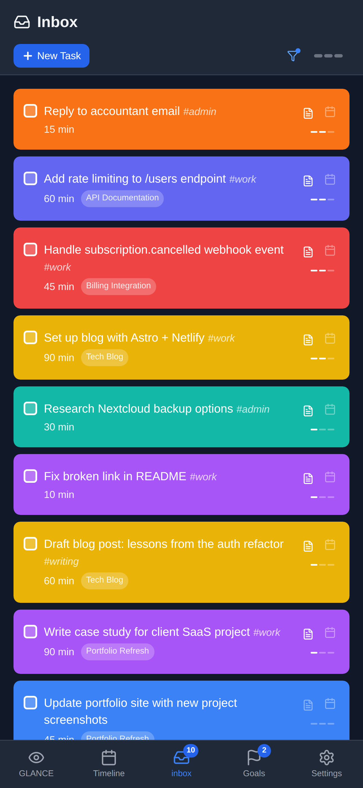
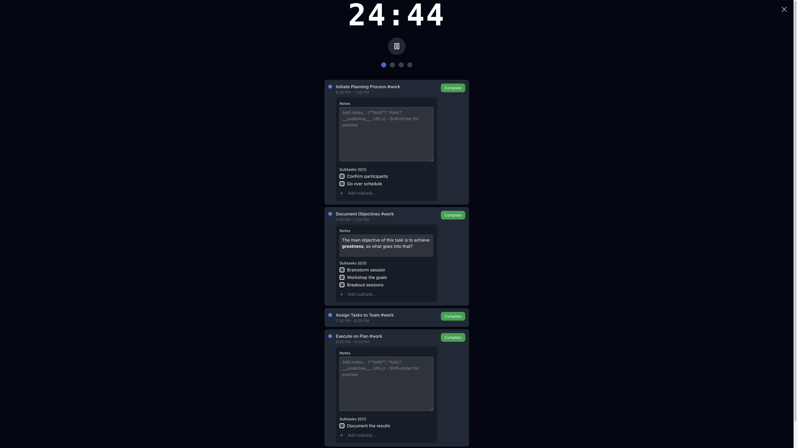
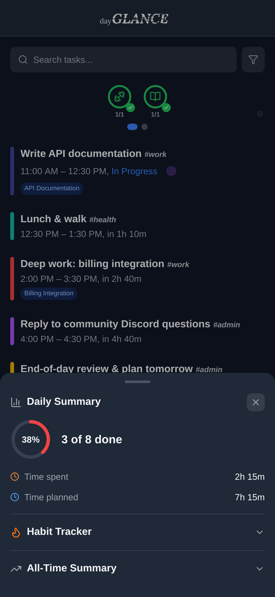
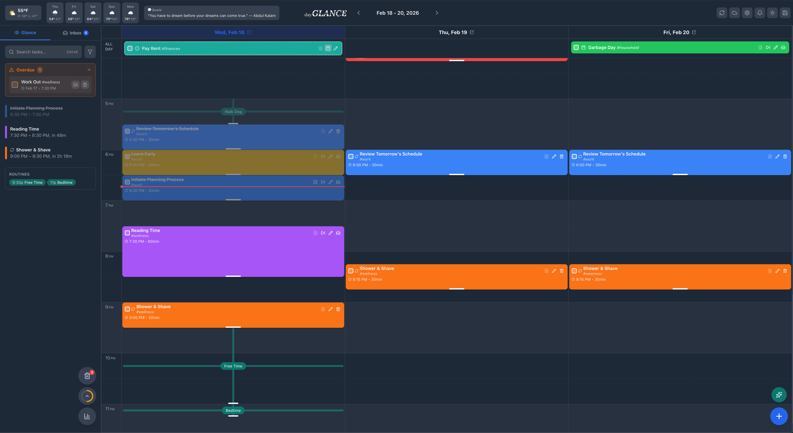

# dayGLANCE

**Your day, at a glance.** A privacy-first, self-hosted day planner with visual time-blocking, task management, and calendar sync -- all in a beautiful Progressive Web App.

[](LICENSE)
[](https://github.com/krelltunez/day-planner)

[Live App](https://dayglance.app) | [Documentation](https://docs.dayglance.app)

<!-- SCREENSHOT: Hero — Desktop full-width view showing the timeline with several color-coded tasks, the sidebar with inbox and daily summary, and the header with weather and daily content. Capture in light mode with a realistic day planned out. -->


---

## Why dayGLANCE?

Most planners either live in someone else's cloud or lack the polish of commercial apps. dayGLANCE gives you both: **a rich, intuitive planning experience** that runs entirely on your own infrastructure. Your data never leaves your server, syncs across devices through your own Nextcloud instance, and works offline as a full PWA.

---

## Features

### Visual Time-Blocking

Drag and drop tasks onto a 24-hour timeline to plan your day. Resize tasks by dragging their edges, move them between time slots, and see conflicts highlighted instantly when tasks overlap. Supports multi-day views (1, 2, or 3 days) depending on screen size.

<!-- SCREENSHOT: Timeline close-up showing 3-4 color-coded tasks at various times, one being dragged, and a conflict indicator where two tasks overlap. -->


### Smart Inbox

Capture tasks as they come to mind without worrying about when to do them. Prioritize with three priority levels, filter by priority, and drag tasks to the timeline when you're ready to commit. Tag tasks with `#hashtags` for quick filtering.

<!-- SCREENSHOT: Sidebar showing the Inbox section with several tasks at different priorities, one task being dragged toward the timeline area. -->


### Recurring Tasks & Routines

Set tasks to repeat daily, weekly on specific days, monthly, or on custom intervals. Edit a single occurrence or the entire series. Build daily **Routines** — reusable task templates for each day of the week that you drag onto the timeline with one gesture.

### Focus Mode

A built-in Pomodoro-style timer with customizable work, short break, and long break durations. Associate a timer session with a specific task and mark it complete when you're done. Keeps your screen awake during focus sessions.

<!-- SCREENSHOT: Focus Mode overlay/modal showing the timer countdown, current task name, cycle count, and start/pause/reset controls. -->


### Daily Summary & Statistics

Track your productivity with a daily dashboard: tasks completed, completion rate ring, time planned vs. time spent, and focus time logged. An all-time statistics view shows lifetime trends, averages, and streaks.

<!-- SCREENSHOT: Daily Summary card showing the completion rate ring, task counts, and time stats. Ideally show both the daily and all-time cards side by side. -->


### Weekly Review

End each week with a guided review. See your weekly stats, reflect with built-in prompts, and plan ahead. Set a configurable weekly reminder so you never skip a review.

### Calendar Sync & Import

Import events from **iCal, Google Calendar, or Nextcloud** calendar URLs. Imported events appear color-coded on your timeline alongside your tasks, refreshing automatically every 15 minutes.

### Cloud Sync with Nextcloud

Sync your entire planner across devices through your own Nextcloud instance via WebDAV. The smart merge engine resolves conflicts at the task level using timestamps — not last-write-wins — so simultaneous edits from two devices won't clobber each other.

### Auto-Backup

Automatic local and remote backups with configurable frequency (hourly, daily, weekly) and retention policies. Restore from any backup with one click. Remote backups stored on your Nextcloud instance.

### Daily Notes

Attach freeform notes to any day for journaling, reflections, or quick references. Notes sync across devices alongside your tasks.

### Dark Mode

A full dark theme that respects your preference across sessions. Every component is theme-aware, including the custom scrollbars and mobile status bar.

<!-- SCREENSHOT: Same desktop view as the hero but in dark mode, showing the dark theme applied consistently across the timeline, sidebar, and header. -->


### Spotlight Search

Press `Ctrl+K` (or `Cmd+K`) to instantly search across all tasks — scheduled, inbox, recurring, and even deleted. Results highlight matching text and let you jump straight to the task.

### Notifications & Reminders

Configurable reminders for calendar events, scheduled tasks, all-day tasks, and recurring tasks. Choose to be notified 15, 10, or 5 minutes before, at the start, or at the end. Supports both in-app toasts and native browser notifications.

### Tags & Filtering

Add `#tags` to any task title. Filter your view by one or more tags, toggle untagged tasks on and off, and get autocomplete suggestions as you type.

### Recycle Bin & Undo/Redo

Deleted tasks go to a recycle bin for easy recovery. A full undo/redo stack lets you reverse any action — task creation, edits, moves, completions, and deletions — with `Ctrl+Z` and `Ctrl+Y`.

### Weather & Daily Content

See current weather conditions, temperature, and a 5-day forecast in the header (by zip code). A rotating panel cycles through dad jokes, fun facts, inspirational quotes, and "this day in history" moments.

### Responsive Across Every Device

dayGLANCE adapts its layout and interactions per device:

- **Desktop**: Multi-day timeline, sidebar with inbox and stats, hover states, mouse drag-and-drop, task resizing
- **Tablet**: Tabbed side panel (Glance | Inbox), floating action buttons, touch-optimized spacing
- **Phone**: Tab-based navigation, swipe gestures to schedule tasks, long-press to drag on the timeline, bottom sheets for modals

<!-- SCREENSHOT: Side-by-side composite of dayGLANCE on a phone (portrait), tablet (landscape), and desktop, showing how the layout adapts. -->


### Progressive Web App

Install dayGLANCE on any device — desktop, tablet, or phone — for a native app-like experience. Works fully offline after first load with service worker caching. Auto-updates when a new version is deployed.

### Getting Started Checklist

A built-in onboarding flow guides new users through the app's features: adding tasks, using drag-and-drop, setting priorities, configuring sync, and more. Tracks progress and unlocks features as you explore.

---

## Quick Start

### Local Development

```bash
# Clone the repository
git clone https://github.com/krelltunez/day-planner.git
cd day-planner

# Install dependencies
npm install

# Start the dev server
npm run dev
```

Open [http://localhost:5173](http://localhost:5173) in your browser.

### Docker Deployment

```bash
# Build and run
docker-compose up -d --build

# View logs
docker-compose logs -f

# Stop
docker-compose down
```

The app will be available at `http://localhost:6767`.

### Production Deployment

1. Clone the repo to your server and run with Docker Compose.

2. Set up a reverse proxy (e.g., Caddy) for HTTPS:

   ```caddy
   dayglance.yourdomain.com {
       reverse_proxy localhost:6767
   }
   ```

3. Access your instance at `https://dayglance.yourdomain.com`.

For detailed deployment instructions, see the [Documentation](https://docs.dayglance.app).

---

## Tech Stack

| Layer | Technology |
|-------|-----------|
| UI Framework | [React 18](https://react.dev) |
| Build Tool | [Vite 5](https://vitejs.dev) |
| Styling | [Tailwind CSS 3](https://tailwindcss.com) |
| Icons | [Lucide React](https://lucide.dev) |
| PWA | [vite-plugin-pwa](https://vite-pwa-org.netlify.app) + Workbox |
| Testing | [Vitest](https://vitest.dev) |
| Containerization | Docker + Nginx |

---

## Cloud Sync Setup

dayGLANCE syncs through your own **Nextcloud** instance via WebDAV. To configure:

1. Open **Settings** in dayGLANCE.
2. Enter your Nextcloud WebDAV URL and credentials.
3. Sync runs automatically every 15 minutes, or trigger it manually.

The sync engine merges at the task level, so edits made on different devices to different tasks will be combined cleanly. When the same task is edited on two devices, the most recent edit wins.

---

## Calendar Import

Import events from any iCal-compatible source:

1. Open **Settings** > **Calendar Import**.
2. Paste your calendar URL (Google Calendar, Nextcloud, iCal, etc.).
3. Events appear on your timeline, refreshing every 15 minutes.

---

## Keyboard Shortcuts

| Shortcut | Action |
|----------|--------|
| `Ctrl/Cmd + K` | Spotlight search |
| `Ctrl/Cmd + Z` | Undo |
| `Ctrl/Cmd + Y` | Redo |
| `Escape` | Close modal / dropdown |

---

## Running Tests

```bash
npm run test
```

---

## Contributing

Contributions are welcome! Please open an issue or pull request on [GitHub](https://github.com/krelltunez/day-planner).

---

## License

[MIT](LICENSE)

---

<p align="center">
  <a href="https://dayglance.app">dayglance.app</a>
</p>
