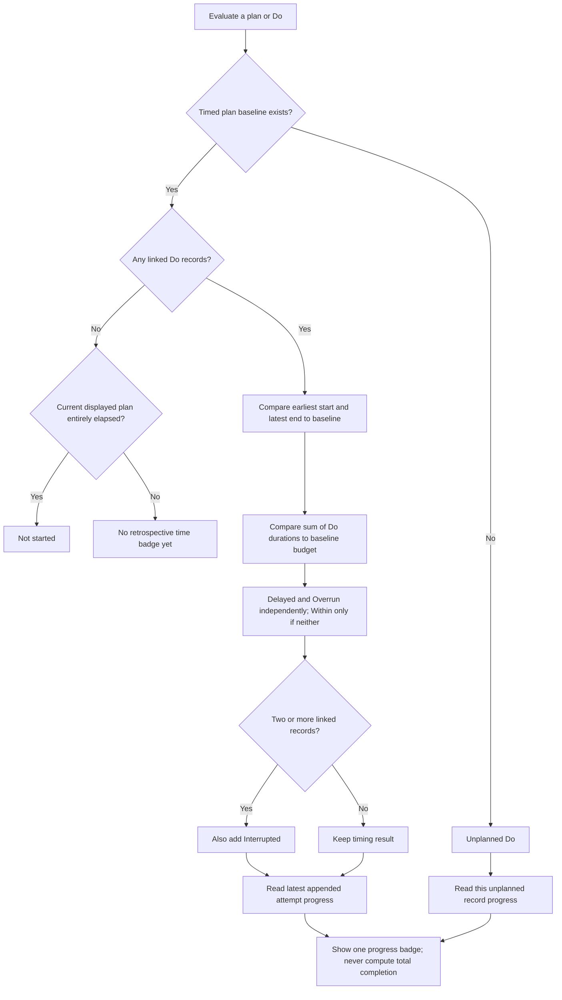
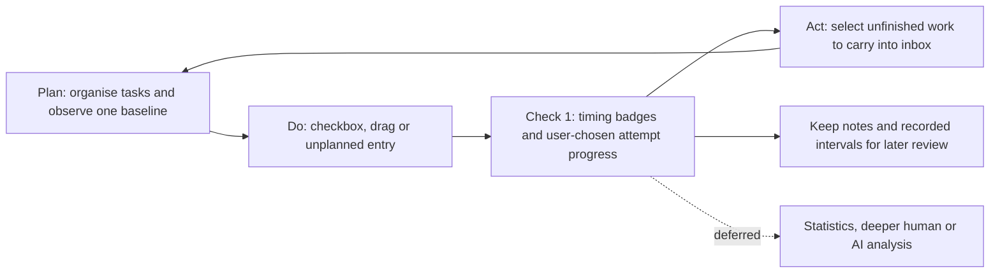

# Jobo: plan, do, notes and a small PDCA loop

Status: opt-in source prototype for design review, following #1623 and #1604.
This document distinguishes implemented behaviour from decisions still needed before release.
It does not propose closing #1623 or replacing every user's day view by default.

## Why this exists

A task has continuity: the same piece of work can move forward over several days and
remain related to a project, goal or area. It also has a temporal dimension: when did
I intend to work on it, and when did I actually work on it? Jobo connects those two
questions without requiring every recorded activity to begin as a to-do item.

Todoist can remain a user's primary task manager. dayGLANCE's own planning and inbox
remain useful too. Jobo should not require either Todoist or Obsidian: the daily
planning, recording and comparison loop belongs in dayGLANCE. An optional readable
Obsidian archive is a possible next step, not a second editor or required backend in
this PR. This answers the question in #1623 after the IndexedDB work: where the
records belong is a product decision, not an attempt to escape a storage quota.

The visual idea comes from paper personal planners: intention, execution and notes
can be understood together. The implementation uses dayGLANCE's existing shell,
theme, task content/actions, note editor, inbox and week layout, not an embedded
second application. No paper-planner assets or third-party font files are included.

## Enablement and compatibility boundary

The experimental checkbox is in desktop Settings, under view preferences. It is
off by default. Only enabled, loaded, single-user, non-tray contexts can mount the
Jobo views. With it off, the original DAY and WEEK components and their checkbox
semantics are unchanged. MULTI, MONTH and SCHED are not replaced. Mobile has no new
Jobo entry in this prototype. Disabling the feature hides the journal; it does not
silently erase its records.

The submitted version is a normal ESM/React source port. Earlier local Windows
previews used a compiled-renderer integration to iterate on the interaction. Those
installers, ASAR files, generated bundles and packaging scripts are not this PR.

## Data concepts

| Object | Meaning | Current ownership |
| --- | --- | --- |
| Native task | Ongoing work and its current schedule | Existing dayGLANCE task state; existing integrations retain their own semantics |
| Plan baseline | First observed valid dated/timed schedule for a task ID | Jobo `plans`; immutable date/start/duration and captured-at timestamp |
| Do record | A user-recorded interval, optionally linked to a plan/source task | Jobo `records`; stable ID and durable append order |
| Progress | The outcome the user assigns to one Do interval | Each Do record, not a task-level percentage |
| Task note | One canonical native task note | Native notes editor and Notes column read/write the same task note |
| Daily note | The existing note for that day | Native daily-note state, displayed last in Notes |
| Presentation | Note heights, tags, explicit note visibility and zoom | Jobo metadata; note size never becomes duration |

Do snapshots preserve identity/title/colour/note context if the source task disappears.
Deleting or rescheduling a task does not automatically erase its history. A Do edit
or deletion is a separate operation. Source notes are shared while the source exists;
legacy independent note text is archived before the shared-note migration replaces it.

### One baseline, not a revision system

Preserving the original plan is the right foundational step. This prototype keeps
one first-observed baseline instead of a full revision log. Current plans remain
editable: a comparison should be informative, not an enforcement mechanism.

**Capture is not yet universal.** It occurs while an enabled, loaded Jobo DAY/WEEK
view observes scheduled tasks (including visible recurring occurrences), and before
Jobo creates a related Do or modifies a plan. This is not an interception of every
upstream scheduling path. Work that was rescheduled before first observation cannot
have its prior intention reconstructed. No old schedule is invented or backdated.
Generalising capture at all scheduling boundaries is a possible smaller first PR.

Unscheduled/all-day tasks do not acquire an invented timed baseline. A task ID is the
linkage key; full recurring-series editing, deduplication across provider identities
and occurrence lineage still need an audit before enabling this widely.

## DAY: Plan | time ruler | Do | Notes

Column headings follow the selected language. The day grid and cards retain the
native theme and task colours. A compact card uses two rows: title/actions, then
clock range, duration and applicable badges. Status does not recolour DAY cards.

- Plan is an editable intention; Do is a recorded interval, not a moved Plan copy.
- Linked Do cards keep the title/time/actions and hide badges. Plan carries the
  comparison and the latest recorded progress control. Unplanned Do has no Plan
  card, so its own card shows `Unplanned`, progress and custom tags.
- A progress badge is a button without a dropdown arrow or longest-option padding.
  Clicking opens four options. Time/progress/custom badges share a compact style;
  custom grey `#` tags are added through `+`, committed on blur/Enter, cancelled by Escape.
- The native Plan note button opens the native notes/subtasks panel. Only a Do note
  button adds the small right arrow and opens/focuses the corresponding Notes tile.
- Notes are stacked, not time-positioned. Text is directly editable, deletion clears
  the note rather than the task, and resizing changes only display height. Nonempty
  linked notes and explicitly opened empty notes are shown. The daily note is last.
- Hover connects related Plan, Do and note tiles; dragging previews the connection.
  A permanent square bracket at the right links multiple visible Do intervals for
  one plan. The current-time line is above cards/connectors and ignores pointer events.

### Why the checkbox is different only here

Checking an unchecked Plan means **record a completed execution attempt**, not
complete the native task. The time proposal is retrospective: end at the current
minute, start one full planned duration earlier. It is intentionally low-friction
self-reporting, not measured activity or proof that the user worked continuously.
The interval can immediately be moved, resized or edited, including across midnight.

Example: checking a 30-minute plan at 14:20 records 13:50-14:20. It does not move the
Plan, change its baseline or call Todoist completion writeback.

Each newly created Do defaults to `Completed`. A plan displays **one** progress badge
for the most recently *appended* Do, not the chronologically latest interval and not
an aggregate of all attempts. Editing an older interval's time therefore cannot
silently change which attempt controls the checkbox. Older progress values remain
stored and can be edited in the Do editor.

Changing that visible attempt to `Started` or `Partially completed` unchecks the
Plan. Checking again appends another completed attempt ending now, of the same full
planned duration. `Mostly completed` and `Completed` leave the checkbox checked.
Clicking an already checked plan does not create accidental duplicate records.
Dragging Plan into Do is the explicit way to append another interval regardless of
checkbox state. Separate intervals are never automatically merged.

## Check part 1: independent time and progress dimensions

Timing is derived from recorded data. Progress is the user's assertion for one
attempt. Neither implies completion of the source task.

| Time status | Exact prototype rule |
| --- | --- |
| Within plan | At least one linked Do, with neither delayed nor overrun |
| Delayed | Earliest recorded start is after baseline start, or latest recorded end is after baseline end |
| Overrun | Sum of linked Do durations is greater than baseline duration; gaps are excluded |
| Interrupted | Two or more linked Do records, even adjacent ones; independent of all other time states |
| Not started | No linked Do and the **current visible Plan has entirely elapsed**; do not use an obsolete baseline to condemn a future reschedule |
| Unplanned | No corresponding timed Plan baseline; no delay/overrun is inferred against an invented one |

Delayed and overrun can coexist, and interrupted can coexist with both or with
within-plan. In this prototype interruption is a segmentation heuristic, not a
claim to detect a real-world interruption or its cause.

By deliberate workflow choice, an elapsed plan without a record is treated as
not started *in this ledger*. There is no additional 'forgot to record' state.
Future and currently-straddling plans are not marked not started. This convention
must not be used later as objective evidence about unrecorded behaviour.

Overlapping independent intervals are currently summed as entered; this is an
investment-of-time comparison, not a union-of-wall-clock-coverage metric. A future
statistics view must decide how overlapping activities should be counted.

## WEEK: history and intention at different dates

The original seven-column week structure is retained. Dates strictly before today
project Do intervals; today and future dates show native plans. This is a whole-date
boundary, not a past-hours/future-hours split inside today. The view does not fill
missing actuals with planned blocks.

Small week blocks use compact status edges, a progress dot and text emphasis rather
than the full badge row. Completed Do backgrounds recede toward the grid without
discarding the interval or timing deviation. Ctrl+wheel adjusts vertical scale,
normal wheel scrolls. WEEK Do opens the Do editor; series/native plan operations
continue to require their existing semantics.

## Act: Carry Forward

A teal button beside New task offers elapsed plans with no Do and individual
Started/Partially-completed attempts. The user can deselect candidates. Confirmation
copies a *new native inbox task* with provenance, not the Do record or its schedule.
Old plans/Do remain, and already-carried sources found in scheduled/inbox tasks are
excluded. External provider identities/tokens and completed state are not copied.
The copy is local at creation; once in the native inbox it follows the user's normal
native backups/sync configuration. Historical partial attempts can still appear
after a later successful attempt: the list intentionally leaves that judgement to
the user instead of inventing an overall completion score.

## Persistence: implemented safeguards and pre-release gaps

This source prototype retains the preview's local schema (`day-planner-jobo-v520`,
version 3), but replaces its storage wrapper with an injectable module. Reads are
lazy; corrupt data fails closed; write success precedes subscriber notification;
failed quota writes and failed undo do not silently acknowledge success. Storage
events update other tabs; a stale snapshot check rejects detected concurrent writes.
That check is **not an atomic cross-tab transaction** and is not claimed as one.

**The backend is still localStorage.** The IndexedDB helper introduced in #1629 is
the intended architectural discussion for an indefinitely growing ledger, but this
PR does not claim to have migrated it. Jobo is original user data, not a derived cache.
Quota, concurrency, reset, native backup/restore and cross-device lifecycle need a
coherent solution before this feature is considered release-ready. A production
implementation must not silently evict old ledger entries to fit a cache budget.

The explicit Jobo JSON backup includes the baseline, Do records, progress, tags,
notes metadata, native tasks/inbox and daily notes. Import validates the ledger and
requires confirmation, then replaces those local collections. It is **not** wired
into every native cloud/file restore/reset path, and is not transactional across the
ledger and native task stores. Restored native tasks may participate in integrations
already enabled by the user. Export first; review this flow before release. Turning
Jobo off is not a purge. The UI labels it experimental/local-only rather than implying
that the native save/cloud button already backs up these extra records.

No Do entries are uploaded to Todoist or Obsidian, and no remote deletions are added.
Native note edits and carried native tasks still obey existing integration settings.
No new tokens, permissions, dependencies or backend services are introduced.

## Deliberately not included

Automatic tracking, importing focus-session spans, a Day Dial or MONTH comparison,
full plan revision history, statistics/AI, mobile Jobo layouts, automatic remaining-
effort estimation, a signed installer, and cross-device journal synchronisation.
Focus spans remain in the existing system; not importing them avoids claiming task
attribution the data does not contain. Future integration needs shared IDs and clear
rules to prevent double counting.

The minute/date model has ordinary midnight cases covered, but timezone travel and
DST transitions require a wider audit. Recurring-series operations, imported read-only
calendar actions, accessibility across every interaction, high-volume data and real
provider round trips are not claimed fully validated. Default-off gating is not a
substitute for that work.

## Source map and review order

1. `src/utils/jobo.js` and its adjacent tests: pure linkage, baseline, time/progress,
   recurrence-independent interval projection and carry-forward rules.
2. `src/jobo/store.js`, `preference.js` and tests: persistence and availability guards.
3. `src/components/jobo/JoboRoutes.jsx`: opt-in gates and native fallback.
4. `src/components/jobo/JoboViews.jsx`, scoped CSS: the interaction prototype.
5. Small integration seams in DesktopLayout, InboxSidebar, SettingsModal,
   TimelineTaskCardContent and WeekView; locale entries use the existing bundles.

The controls have English and Simplified Chinese copy. Other existing locale bundles
currently carry explicit English fallback values for the new namespace; that is key
parity, not a claim of six additional reviewed translations.

A smaller baseline/core PR can be extracted if that is preferable. This larger draft
makes the proposed semantics inspectable in one place and exposes the decisions
that need agreement, rather than treating the initial implementation as settled policy.
